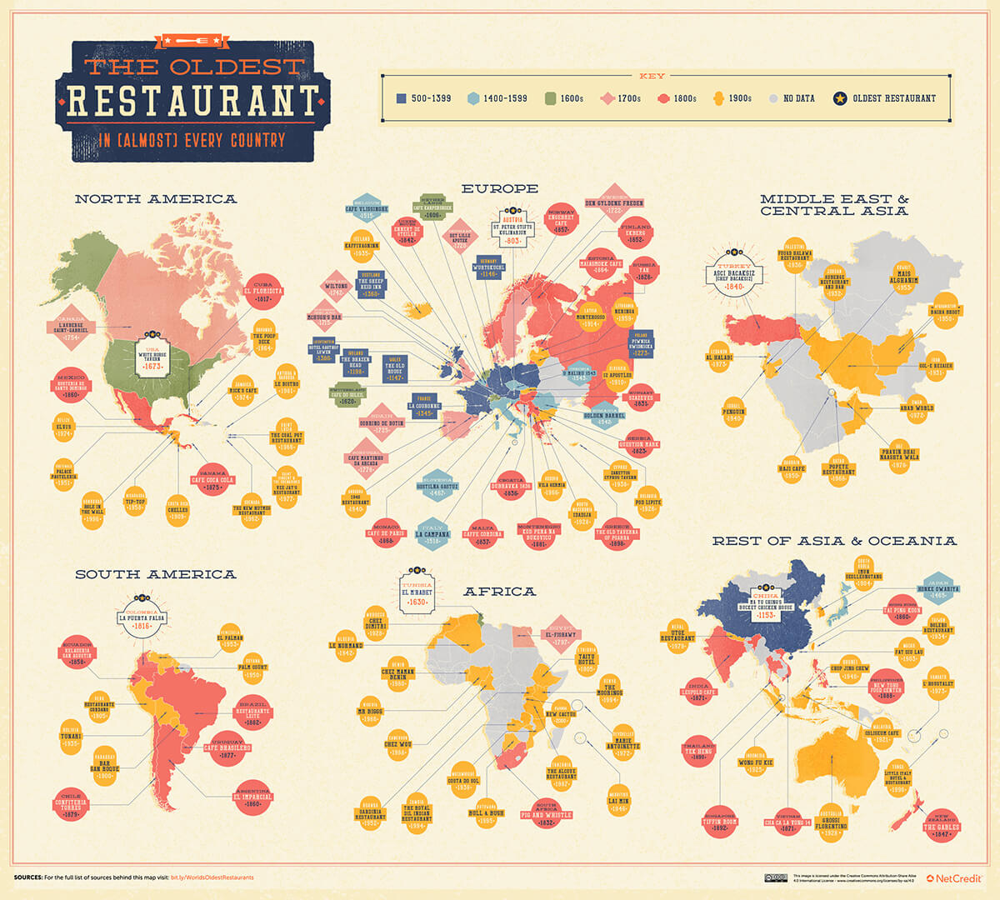
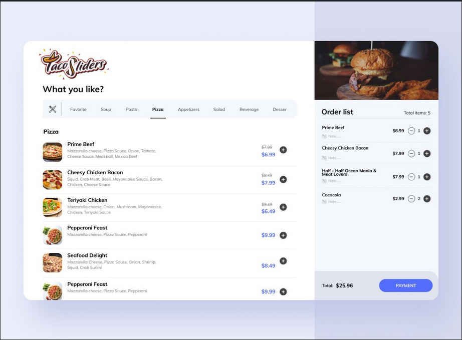

# voyage-project-tier1-restaurant-simulator

## Table of Contents

* [Overview](#overview)
* [General Instructions](#general-instructions)
* [Requirements & Specifications](#requirements-specifications)
* [Acknowledgements](#acknowledgements)
* [About Chingu](#about-chingu)

## Overview

Welcome, Chingus!

Are you ready to embark on a journey into the vibrant world of restaurant management? Experience the excitement of building and running your own culinary venture from scratch.

From ancient civilizations like Rome and China to the bustling kitchens of 18th-century France, restaurants have been important in serving communities and travelers alike. Over the centuries, they've evolved into cultural hubs, offering everything from fine dining experiences to fast food and global cuisines.

In this voyage, your team will create and manage your dream restaurant, from designing the menu to handling customer orders and managing finances. Get ready to unleash your creativity and business skills in the exciting world of restaurant simulation!

Bon appétit and happy managing!

## General Instructions

This project is designed to be worked on by a team rather than an individual
Chingu. This means you and your team will need to thoroughly read and
understand the requirements and specifications below, **_and_** define and
manage your project following the _Agile Methodology_ defined in the
[Voyage Handbook](https://github.com/chingu-voyages/Handbook/blob/main/docs/guides/voyage/voyage.md#voyage-guide).

As you create this project make sure it meets all of the requirements, but once
it reaches MVP, start implementing the optional features or get creative and
extend it in ways we haven't envisioned. In other words, use the power of
teamwork to make it distinctive and unique.

Take note that we haven't given specific direction on what your UI/UX should
look like. This is another area where you and your team can put your creativity 
to work! 

## Requirements & Specifications

### What You Need to Do

The following define the minimum requirements and ideas for features you may
implement to enhance this app, if time permits.

#### Structure

- [ ] This is a purely frontend application. No backend is required.
- [ ] You may use any languages, tools, or libraries you prefer when designing and building this app.
- [ ] You may **_NOT_** use AI-base solution generators like GitHub CoPilot.
- [ ] We've included a JSON file containing the raw data in the /assets directory in this repo. But, if you choose, you may use the Menus API instead.
- [ ] Useful links and resources:
  - [Menus API](https://menus-api.vercel.app/)

#### Styling

- [ ] Surprise us!!! Use your teams creativity to make this app distinctive.
- [ ] Add a footer containing a link to your teams GitHub repo.
- [ ] In general, you will find these [UI design principles](https://www.justinmind.com/ui-design/principles) helpful.
- [ ] Recommend using this resource for [clean CSS](https://israelmitolu.hashnode.dev/writing-cleaner-css-using-bem-methodology).

#### Functionality

-   Overview:
    - [ ] Develop a single-page application (SPA) that simulates a restaurant menu and ordering system.

-   Menu Fetching and Display
    - [ ] Fetch menu data from the provided JSON file.
    - [ ] Display the fetched menu items in respective categories on the page.
    - [ ] Ensure the menu includes images, names and prices for each item.
    
-   Order Management

    - [ ] Implement functionality to add menu items to an order.
    - [ ] Display the current order summary, including item names, prices, and total cost.
    - [ ] Provide an option to add tips to the order total.
    - [ ] Ensure users can remove items from the order before finalizing it.
    - [ ] leverage the browser's local storage to store order data efficiently

-   Payment Processing

    - [ ] Implement a credit system where users can add credit to their account.
    - [ ] Ensure users can make payments using their available credit.
    - [ ] Validate sufficient credit before processing the payment and provide appropriate feedback to the user.

-   User Interface and Experience

    - [ ] Ensure the application provides a seamless user experience for browsing the menu, adding items to the order, and making payments.
    - [ ] Implement intuitive UI/UX elements to guide users through the menu browsing and ordering process.
    - [ ] Use responsive design techniques to ensure the application is accessible and functional across various devices and screen sizes.

### Extras (Not Required)

- Menu Customization

  - [ ] Utilize the Menus API to retrieve restaurant data and dynamically add more categories to the menu.
  - [ ] Implement filters and search functionality to easily find specific menu items.

## Acceptance Criteria

- Menu Fetching and Display

  - [ ] The application should fetch menu data from the provided JSON file and categorize it by:
      - meals,
      - drinks,
      - desserts.
  - [ ] All menu items must be displayed with:
      - images, 
      - names, 
      - prices.
  - [ ] Users should be able to view the menu in an organized manner, with categories clearly delineated.

- Order Management

  - [ ] Users should be able to:
      - add items to their order,
      - view a summary of their current order,
      - add tips to their order total,
      - remove items from their order before finalizing it.
  - [ ] App utilizes the browser's local storage for storing user credit and order data.

- Payment Processing

  - [ ] Users should be able to add credit to their account and view their balance.
  - [ ] Payments should only be processed if the user has sufficient credit.
  - [ ] The application should provide feedback to the user on successful or unsuccessful payment attempts.

- User Interface and Experience

  - [ ] The application must provide an intuitive and seamless user experience for browsing the menu and placing orders.
  - [ ] Responsive design techniques must be used to ensure functionality across various devices and screen sizes.

## Acknowledgements

We express gratitude to the [free-food-menus-api](https://github.com/igdev116/free-food-menus-api) for enabling us to incorporate a diverse range of menu items into our application. Additionally, we appreciate the contributions of the wider developer community whose insights and expertise continually enrich our projects.

## About Chingu

If you aren’t yet a member of Chingu we invite you to join us. We help our
members transform what they’ve learned in courses & tutorials into the
practical experience employers need and want.
